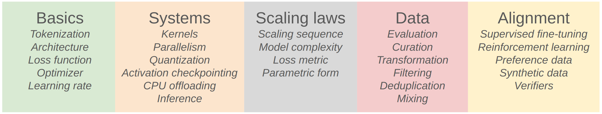
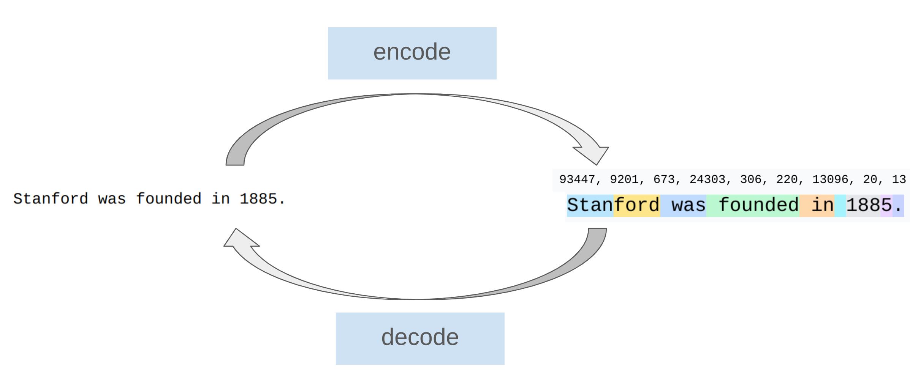
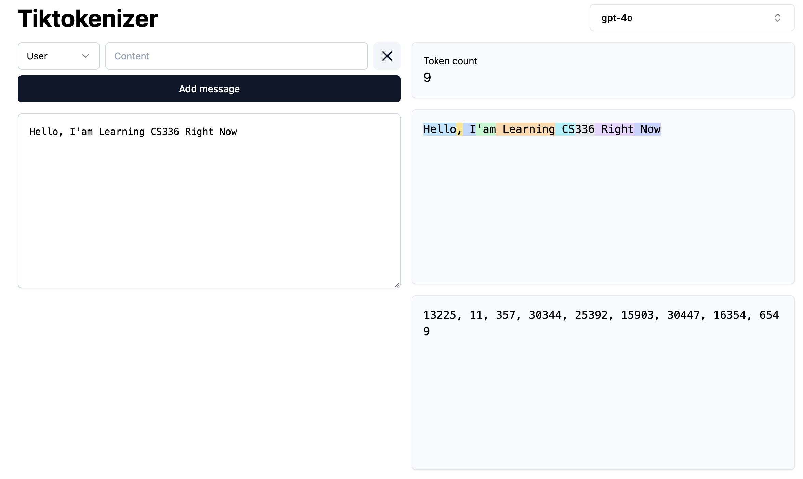
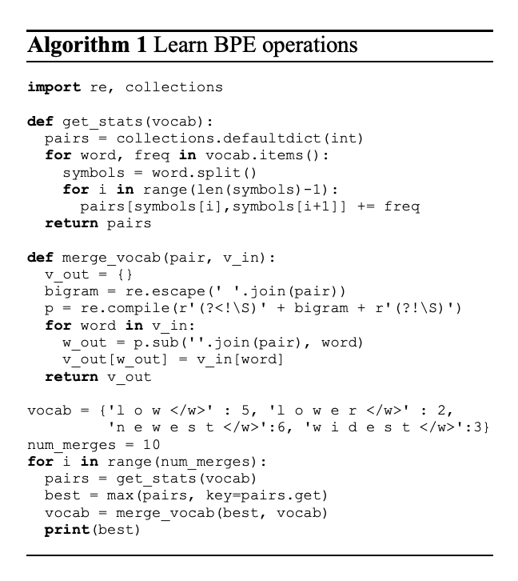

<iframe width="100%" height="600" src="https://www.youtube.com/embed/SQ3fZ1sAqXI?si=zuOzF17g_lACfOtf" title="YouTube video player" frameborder="0" allow="accelerometer; autoplay; clipboard-write; encrypted-media; gyroscope; picture-in-picture; web-share" referrerpolicy="strict-origin-when-cross-origin" allowfullscreen></iframe>

# Introduction
Lecture 01 的前半段介绍了什么是LLM以及课程的大纲安排。总体来说，课程的基本的内容会由如下的几个部分组成：

:::{#fig-course-overview}


课程的5大块内容
:::

这些部分会在后续的Lecture中逐步展开介绍。在这里，我们不做过多赘述，在这里我们重点介绍课程的后半部分内容，即**Tokenization**。学习完本章节后，我们可以开始尝试Assignment01的第一部分，即BPE-Tokenization的实现。

::: {.callout-warning}
个人感觉BPE的部分是整个课程中最难理解的部分，建议多花时间理解清楚。同时这部分也可能是在Assignment中花费时间最多的部分（可能是因为我个人对这部分理解不够透彻的原因）。 总之，遇到困难不要气馁，慢慢来，大家都是这样过来的！！
:::


# Tokenization
Tokenization是Language Modeling的第一步。它的作用是<u>将文本转换为模型可以理解和处理的形式</u>。Tokenization的过程就是将文本拆分成更小的单位（称为tokens），并为每个token分配一个唯一的整数ID。

Tokenization的过程如下图所示：

::: {#fig-tokenization-overview}



Tokenization的过程示意图，主要由两个步骤组成: `encode`和`decode`。
:::

用代码显示就是
```{.python}
class Tokenizer:
    def __init__(self):
        pass 

    def encode(self, text: str) -> list[int]:
        """将文本转换为token ids的过程"""
        pass
    def decode(self, token_ids: list[int]) -> str:
        """将token ids转换为文本的过程"""
        pass
```


::: {#fig-tokenization-example}

[](https://tiktokenizer.vercel.app/?encoder=gpt2)


Tokenization 示例. 访问这个[链接](https://tiktokenizer.vercel.app/?encoder=gpt2)可以在线体验不同的tokenizer的效果。
:::


接下来，我们来看一下不同的 tokenization 之间的区别是什么，以及为什么我们需要不同的 tokenization 方法。 首先，我们来看一下常见的几种 tokenization 方法：

- Character-level Tokenization: 将文本拆分为单个字符。
- Word-level Tokenization: 将文本拆分为单词。
- Subword-level Tokenization: 将文本拆分为子词单元（如BPE, WordPiece, Unigram等）。
- Byte-level Tokenization: 将文本拆分为字节单元（如GPT-2的tokenizer）。

我们由从不同的分词的例子来看一下不同的tokenization方法的区别， 首先介绍最简单的Character-level Tokenization：


## Character-level Tokenization
Character-level Tokenization是将文本拆分为单个字符。 例如，句子 "Hello, world!" 会被拆分为以下tokens：

```{text}
['H', 'e', 'l', 'l', 'o', ',', ' ', 'w', 'o', 'r', 'l', 'd', '!']
```


需要知道的就是，每个Character就是一个token，利用Python，的`ord()`函数，我们可以将其转换为对应的整数ID：

```{.python}
text = "Hello, world!"
tokens = [char for char in text]
token_ids = [ord(char) for char in tokens]
print(tokens)
print(token_ids)
```


这种方式很简单，也很直观，但是它有一些明显的缺点：

1. *Vocabulary Size*：对于所有可能的字符（包括字母、数字、标点符号和特殊字符），Vocabulary Size会非常大，导致模型参数量增加。（大约有150K 个不同的字符）
2. 150K个字符中，有很多字符是非常少见的，导致模型难以学习到这些字符的表示。
3. 语义信息缺失：单个字符无法捕捉到词语的语义信息，导致模型难以理解上下文。

## Word-level Tokenization
与Character-level Tokenization不同，Word-level Tokenization是将文本拆分为单词。 例如，句子 "Hello, world!" 会被拆分为以下tokens：

```{text}
['Hello,', 'world!']
```

每个单词就是一个token，同样地，我们可以通过一个简单的Python代码将单词转换为对应的整数ID：

```{.python}
import regex

text= "Hello, world!"
tokens = text.split()  # 简单的空格拆分
vocab = {word: idx for idx, word in enumerate(set(tokens))}
token_ids = [vocab[word] for word in tokens]
print(tokens)
print(token_ids)
```


除了简单的根据空格拆分单词的方法，我们还可以有稍微复杂一点的方法，比如使用正则表达式来处理标点符号等。举个例子，GPT-2的tokenizer就是使用了一种基于正则表达式的方法来进行Word-level Tokenization。

```{.python}
GPT2_TOKENIZER_REGEX = r"""'(?:[sdmt]|ll|ve|re)| ?\p{L}+| ?\p{N}+| ?[^\s\p{L}\p{N}]+|\s+(?!\S)|\s+"""
```

当然，这种方法也有比较明显的缺点：

1. Vocabulary Size 依然很大：对于所有可能的单词，Vocabulary Size会非常大，导致模型参数量增加。
2. 未登录词问题（Out-of-Vocabulary, OOV）：对于训练集中未出现的单词，模型无法处理，导致性能下降。 尽管我们可以通过一些方法（如使用特殊的`<UNK>` token）来缓解这个问题，但仍然无法完全解决。
3. Vocabulary Size 的大小不是固定的，随着训练数据的增加，Vocabulary Size会不断增加，导致模型难以扩展。
4. 很多单词是非常少见的，导致模型难以学习到这些单词的表示。

## Byte-Based Tokenization
在学习Byte Pair Encoding (BPE)之前，我们先介绍一下Byte-Based Tokenization。 Byte-Based Tokenization是将文本拆分为字节单元（byte-level tokens）。 例如，句子 "Hello, world!" 会被拆分为以下tokens：

```{text}
['H', 'e', 'l', 'l', 'o', ',', ' ', 'w', 'o', 'r', 'l', 'd', '!']
```

每个字节就是一个token，同样地，我们可以通过一个简单的Python代码将字节转换为对应的整数ID：

```{.python}
text = "Hello, world!"
tokens = [char.encode('utf-8') for char in text]
token_ids = [byte[0] for byte in tokens]
print(tokens)
print(token_ids)
```

这种方法的优点是：

1. *Vocabulary Size* 固定且较小：由于字节的范围是0-255，Vocabulary Size固定为256，模型参数量较小。
2. *无OOV问题*：由于所有文本都可以表示为字节序列，不存在OOV的问题。
3. *适用于多语言文本*：字节级别的表示可以处理各种语言的文本。
4. *简单高效*：字节级别的表示简单且高效，适合大规模文本处理。

不过，这种方法有个明显的缺点就是Compression Ratio较低。 由于字节级别的表示过于细粒度，导致<u>文本长度增加</u>，影响模型的训练效率和性能。因为Transformer模型的计算复杂度与输入长度的平方成正比，输入长度增加会显著增加计算资源的消耗。


## Byte Pair Encoding (BPE)
为了克服Character-level和Word-level Tokenization的缺点，同时提高Byte-Based Tokenization的Compression Ratio，我们引入了Byte Pair Encoding (BPE)算法 [@NeuralMachineTranslation2016sennrich] 。 BPE是一种基于**频率**的子词单元（subword unit）分词方法。 它的基本思想是<u>通过迭代地合并最频繁出现的字符对（byte pairs）来构建一个更紧凑的词汇表</u>。


::: {.columns layout-ncol="2"}
::: {.column}
BPE算法的步骤如下：

1. **初始化Vocabulary**：将文本中的所有唯一字符作为初始的词汇表（vocabulary）。
2. **统计频率** `get_stats`：计算文本中所有相邻字符对的出现频率。
3. **合并字符对并且更新Vocabulary**：选择出现频率最高的字符对，将其合并为一个新的token，并更新文本中的所有出现该字符对的地方，并且将新token添加到词汇表中。
5. **重复步骤2-4**：重复上述步骤，直到达到预定的词汇表大小或满足其他停止条件。
:::

::: {.column}

::: {#fig-BPE-algorithm}



BPE算法的示意图，展示了字符对的合并过程。
:::

:::
:::


下面是一个简单的BPE算法的Python实现示例：

```{.python}
def train_bpe(string: str, num_merges: int):
    indices = list(map(int, string.encode("utf-8"))) 
    merges: dict[tuple[int, int], int] = {}  
    vocab: dict[int, bytes] = {x: bytes([x]) for x in range(256)}  

    for i in range(num_merges):
        counts = defaultdict(int)
        for index1, index2 in zip(indices, indices[1:]): 
            counts[(index1, index2)] += 1
        
        pair = max(counts, key=counts.get)  # @inspect pair
        index1, index2 = pair

        new_index = 256 + i
        merges[pair] = new_index
        vocab[new_index] = vocab[index1] + vocab[index2]
        indices = merge(indices, pair, new_index)

    return merges, vocab
```


以上是最简单的BPE算法的实现，显然有很多的不足，我们在Assignment 01的第一部分中，会优化这个实现：

- 优化 `merge` 函数的效率。
- 利用pre-tokenization来加速BPE的训练过程。

等

对于那些想深入理解BPE算法的同学，可以参考以下资源：
<iframe width="100%" height="600" src="https://www.youtube.com/embed/zduSFxRajkE?si=M8MihCWa5cU7xJ88" title="YouTube video player" frameborder="0" allow="accelerometer; autoplay; clipboard-write; encrypted-media; gyroscope; picture-in-picture; web-share" referrerpolicy="strict-origin-when-cross-origin" allowfullscreen></iframe>


关于BPE算法，还有很多可以优化的地方，比如：

- 在寻找最频繁字符对时，可以使用更高效的数据结构（如优先队列）来加速查找过程。
- 在合并字符并且更新文本时，可以使用更高效的字符串处理方法来减少时间复杂度。这些优化可以显著提高BPE算法的训练速度，特别是在处理大规模文本数据

这些方法我们将在 [Assignment 01](https://yyzhang2025.github.io/posts/LearningNotes/CS336/Assignments/Ass01/ass01.html)中进行更加详细的介绍。

# Summary
在本章节中，我们介绍了Tokenization的基本概念和常用方法。 我们重点介绍了Byte Pair Encoding (BPE)算法的原理和实现。 接下来我们来对比一下不同的tokenization方法的优缺点：

:::{.column-page scrollable = true}
| Tokenization Level       | Method|  Vocabulary Size       | Handles OOV | Compression Ratio | Complexity        |
|---------------------------|-----------------------|--------------|-------------------|-------------------|
| Character-level          |每个字符都是一个token  |Very Large (~150K)    | No           | Low               |
| Word-level               |每个单词都是一个token  |Very Large (Dynamic)  | No           | Medium            | Medium          |
| Byte-level               |将文本视为字节序列，每个字节都是一个token |Fixed (256)           | Yes          | Low               | Low              |
| Byte Pair Encoding (BPE) |将文本视为子词单元，通过迭代合并最频繁的字节对构建词汇表 |Medium (Configurable) | Yes          | Medium            | Medium          |    
: Summary  of 4 Tokenization Algorithms {#tbl-tokenization-summary} {.hover }

:::