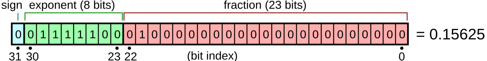
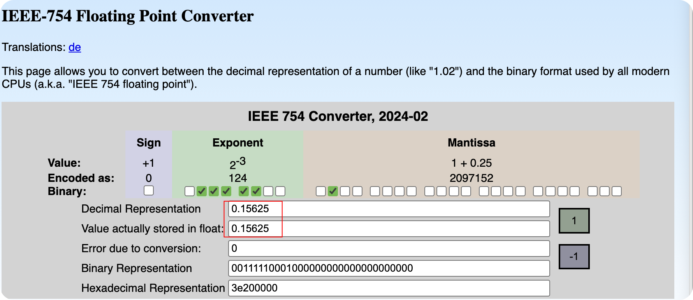
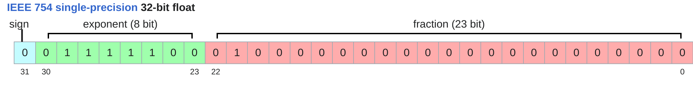
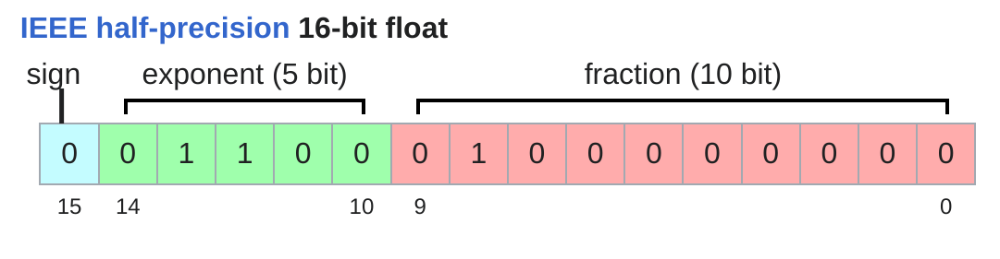
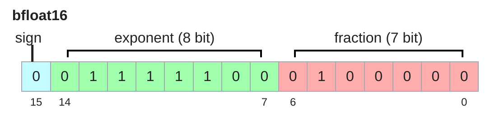
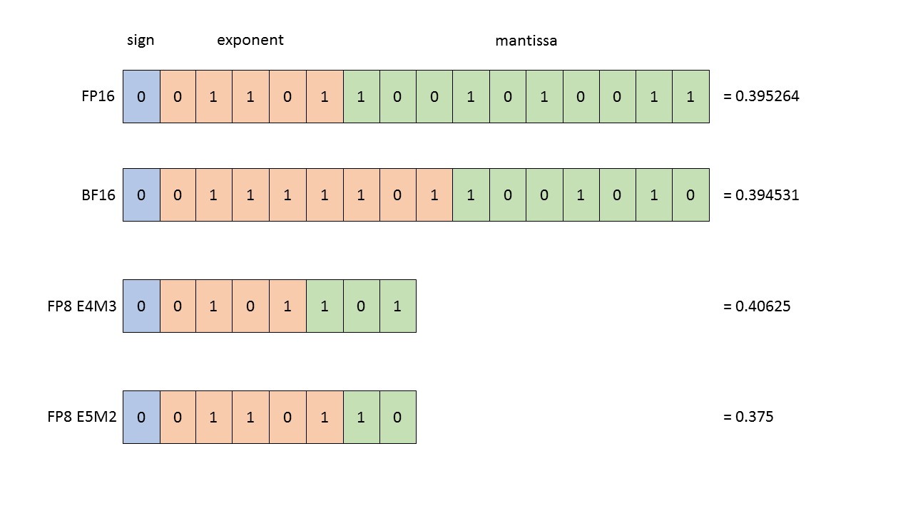
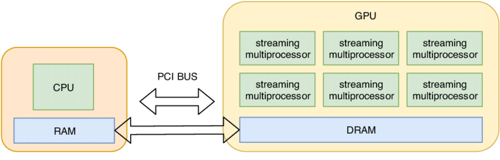
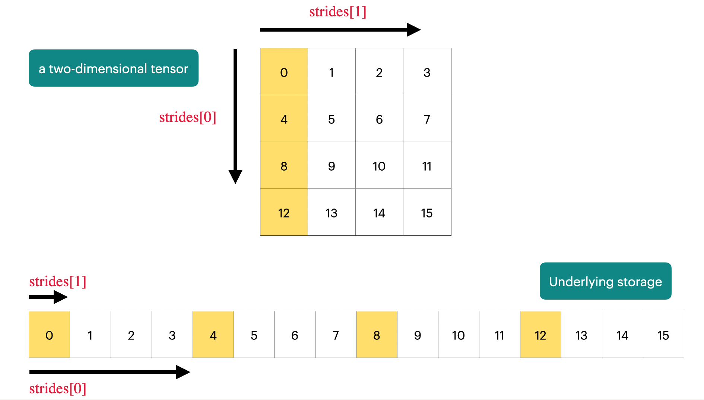
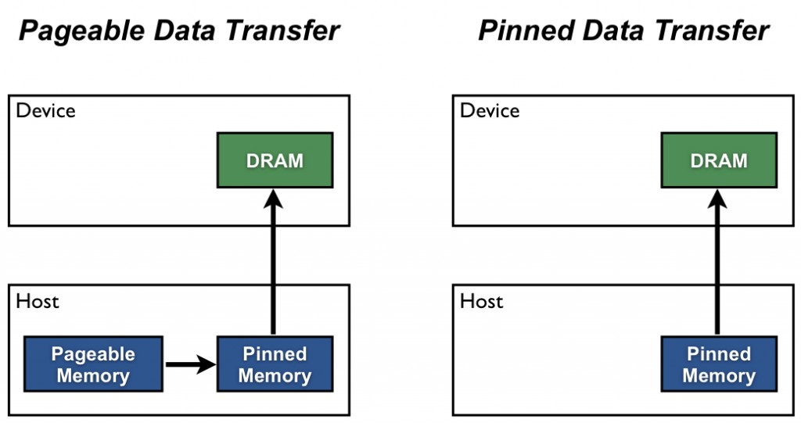

Lecture 02 主要介绍了 PyTorch 的基础知识和一些实用的工具库，比如 `einops`。课程内容涵盖了张量操作、数据类型、优化器等方面的内容。并且最重要的是，提出了一个 Resource Accounting， 即训练一个模型，我们需要多大的内存和计算资源。 通过 Resource Accounting，我们可以更好地理解模型训练的资源需求，从而优化模型设计和训练过程。

课程视频如下所示：


<iframe width="100%" height="600" src="https://www.youtube.com/embed/msHyYioAyNE?si=AedKnJdN7bHvetp3" title="YouTube video player" frameborder="0" allow="accelerometer; autoplay; clipboard-write; encrypted-media; gyroscope; picture-in-picture; web-share" referrerpolicy="strict-origin-when-cross-origin" allowfullscreen></iframe>

# Resource Accounting
首先我们先思考两个问题：

::: {.callout-question}
<tag style='color:red'>Question 1: </tag> <br/>
训练一个 70B 参数的模型，同时用 15T tokens 进行训练，在 1024 个 H100 GPU 上训练，需要多长时间？
:::

::: {.callout-question}
<tag style='color:red'>Question 2: </tag> <br/>
利用8个H100 GPU 并且AdamW Optimizer，我们最多可以训练多大的模型？
:::

要解决以上的几个问题，我们需要了解几个知识点：

- 模型的参数量 (Number of Parameters)
- 参数的数据类型 (Data Types)
- Optimizer 需要储存的额外状态 (Optimizer States)
- GPU 显存大小 (GPU Memory Size)

通过了解这些知识点，我们可以计算出训练一个模型所需的内存和计算资源，从而回答上述问题。

::: {.callout-note}
需要注意的是，以上的计算只是一个估算，我们并没有考虑到所有的细节，比如激活值 (Activations)、梯度 (Gradients) 等等。但是通过这些估算，我们可以对模型训练的资源需求有一个大致的了解。
:::


## Memory Accounting 
所有的数据（包括模型参数、激活值、梯度、优化器状态等）都是以 Tensor 的形式储存。我们有很多种方式创建一个 Tensor，比如：

```{.python}
x = torch.tensor([[1., 2, 3], [4, 5, 6]])
x= torch.randn(3, 4)
x = torch.zeros(2, 5)
x = torch.empty(10, 10)
```

每个 Tensor 都有一个数据类型 (Data Type)，默认的数据类型是 `float32` (也称为 `FP32`)。不同的数据类型会占用不同的内存空间。接下来我们来看看几种常见的数据类型及其内存占用


### Common Data Types

在了解不同的Float Types之前，我们先来了解一下浮点数的表示方法。计算机中的浮点数通常采用 [IEEE 754 标准](https://en.wikipedia.org/wiki/IEEE_754)进行表示。浮点数由三部分组成：符号位 (Sign Bit)、指数位 (Exponent Bits) 和尾数位 (Mantissa Bits), 也叫Fraction 。

::: {#fig-illustration-float-represent}



浮点数的表示
:::

浮点数的值可以通过以下公式计算：
$$
number = (-1)^{Sign} \times Base^{(Exponent - Bias)} \times 1.Mantissa
$${#eq-float-value}

其中，Base 通常为2，Bias 是一个用于调整指数的偏移量，具体取决于指数位的长度, 通常为2的指数位长度减1的值 为127。

\text{fraction} = b_1·2^{-1} + b_2·2^{-2} + b_3·2^{-3} + ... + b_{23}·2^{-23}

对于 @fig-illustration-float-represent 中的浮点数表示：

- 符号位 (Sign) 为 0，表示正数
- 指数位 (Exponent) 为 `01111100`，转换为十进制为 124，减去 Bias 127 得到 -3
- 尾数位 (Mantissa) 为 `01000000000000000000000` ，转换为十进制为 0.25，因此 1.Mantissa = 1 + 0.25 = 1.25

将这些值代入公式 @eq-float-value 中，可以计算出浮点数的值为：
$$
number = (-1)^0 \times 2^{-3} \times 1.25 = 0.15625
$$

比如 bias 10000000，转换为十进制为 128，减去 Bias 127 得到 1


::: {#fig-IEEE-754-Calculator}



通过这个[在线计算器](https://www.h-schmidt.net/FloatConverter/IEEE754.html)，验证浮点数的表示方法。
:::


明白了Float Number的计算方法之后，我们来看看几种常见的数据类型及其内存占用。

#### Float32 

::: {#fig-illustration-float32}



Float32 使用32位 (4字节) 来表示一个浮点数。它由1位符号位、8位指数位和23位尾数位组成，可以表示大约7位十进制有效数字。
:::

Float32 也叫 single precision 是深度学习中最常用的数据类型，几乎所有的深度学习框架都默认使用 Float32 作为张量的数据类型。
Float32 可以表示的数值范围大约在 1.18e-38 到 3.4e+38 之间，足以满足大多数深度学习任务的需求。

```{.python}
x = torch.tensor([1.0, 2.0, 3.0])
print(x.dtype)  # 输出: torch.float32
print(x.element_size())  # 输出: 4 (每个元素占用4字节)
```


::: {#fig-illustration-float16}



Float16 使用16位 (2字节) 来表示一个浮点数。它由1位符号位、5位指数位和10位尾数位组成，可以表示大约3位十进制有效数字。
:::


Float16 也叫 half precision，主要用于减少内存占用和加速计算。相比于 Float32，Float16 可以显著降低内存使用量，从而允许我们训练更大的模型或者使用更大的批量大小 (Batch Size)。

Float16 可以表示的数值范围大约在 6.1e-5 到 6.5e+4 之间，相比于 Float32 有一定的限制，尤其是在表示非常小或者非常大的数值时可能会出现溢出（Overflow）或者下溢（Underflow）的问题。当这个问题出现时，我们可能会出现`NaN`的情况，由此导致训练失败。

::: {.callout-tip}
当我们训练神经网络时，损失函数出现`NaN`的情况，通常是因为数值溢出或者下溢导致的。
:::

```{.python}
In [14]: x = torch.tensor([1e-8], dtype=torch.float16)

In [15]: x
Out[15]: tensor([0.], dtype=torch.float16)

In [8]: x = torch.tensor([1e+8], dtype=torch.float16)

In [9]: x
Out[9]: tensor([inf], dtype=torch.float16)
```


#### BFloat16


::: {#fig-illustration-bfloat16}



BFloat16 使用16位 (2字节) 来表示一个浮点数。它由1位符号位、8位指数位和7位尾数位组成，可以表示大约3位十进制有效数字。
:::

Google 在2018年提出了 BFloat16 (Brain Float Point 16) 数据类型，主要用于深度学习加速。相比于 Float16，BFloat16 保留了与 Float32 相同的指数位长度，因此可以表示更大的数值范围，从而减少了溢出和下溢的风险。相对于Float32， BFloat16 的精度较低，但在许多深度学习任务中，BFloat16 的精度已经足够使用。

```{.python}
In [11]: x
Out[11]: tensor([1.0014e+08], dtype=torch.bfloat16)

In [12]: x = torch.tensor([1e-8], dtype=torch.bfloat16)

In [13]: x
Out[13]: tensor([1.0012e-08], dtype=torch.bfloat16)
```


```{.python}
In [16]: torch.finfo(torch.float32)
Out[16]: finfo(resolution=1e-06, min=-3.40282e+38, max=3.40282e+38, eps=1.19209e-07, smallest_normal=1.17549e-38, tiny=1.17549e-38, dtype=float32)

In [17]: torch.finfo(torch.float16)
Out[17]: finfo(resolution=0.001, min=-65504, max=65504, eps=0.000976562, smallest_normal=6.10352e-05, tiny=6.10352e-05, dtype=float16)

In [18]: torch.finfo(torch.bfloat16)
Out[18]: finfo(resolution=0.01, min=-3.38953e+38, max=3.38953e+38, eps=0.0078125, smallest_normal=1.17549e-38, tiny=1.17549e-38, dtype=bfloat16)
```

#### FP8
FP8 是一种8位浮点数表示方法，通常用于极端内存受限的场景（比如将模型部署到边缘设备）。FP8 有两种主要格式：E4M3 和 E5M2。

::: {#fig-illustration-fp8  }



FP8 使用8位 (1字节) 来表示一个浮点数。E4M3 由1位符号位、4位指数位和3位尾数位组成；E5M2 由1位符号位、5位指数位和2位尾数位组成。
:::

E4M3 (range [-448, 448]) and E5M2 ([-57344, 57344]).

#### Other Data Types
除了上述几种常见的数据类型之外，还有一些其他的数据类型，比如 `int8` 和 `int4`。这些数据类型通常用于量化 (Quantization) 技术，通过将浮点数转换为整数来减少内存占用和加速计算。


| Data Type | Description        | Bits per Value | Bytes per Value |
|-----------|--------------------|----------------|-----------------|
| `float32` | Single Precision   | 32             | 4               |
| `float16` | Half Precision     | 16             | 2               |
| `bfloat16`| Brain Float        | 16             | 2               |
| `int8`    | 8-bit Integer      | 8              | 1               | 
| `int4`    | 4-bit Integer      | 4              | 0.5             |


我们可以看到，不同的数据类型有不同的内存占用。选择合适的数据类型可以帮助我们在内存受限的情况下训练更大的模型或者使用更大的批量大小：

- 用 `float32` 进行训练，适用于大多数任务，但内存占用较高。
- 用 `float16` 进行训练，可以显著减少内存占用，但需要注意数值溢出和下溢的问题。
- 用 `bfloat16` 进行训练，可以在减少内存占用的同时，保持较大的数值范围，适用于大多数深度学习任务。
- 用 `int8` 或 `int4` 进行量化训练，可以极大地减少内存占用，但需要进行额外的量化和反量化操作，适用于部署阶段。

因此在训练的过程中，我们通常采用一种Mixed Precision Training的方法，来平衡内存占用和数值精度的问题。


## Compute Accounting 
在了解了内存占用之后，我们来看看计算资源的需求。计算资源主要取决于模型的参数量和训练数据的规模。

### Tensor on GPUs
当我们创建一个 Tensor 时，它默认是在 CPU 上创建的。如果我们想要在 GPU 上进行计算，需要将 Tensor 移动到 GPU 上：
```{.python}
x = torch.tensor([1.0, 2.0, 3.0])
x.device  # 输出: cpu
x = x.cuda()  # 将 Tensor 移动到 GPU 上
x.device  # 输出: cuda:0
```


::: {#fig-cpu-to-gpu}



我们将Tensor从CPU的RAM上，移动到DRAM上。
:::


我们可以通过以下方式创建一个直接在 GPU 上的 Tensor：
```{.python}
x = torch.tensor([1.0, 2.0, 3.0], device='cuda')
``` 

可以通过GPU的内存情况来查看当前 GPU 上的内存使用情况：
```{.python}
import torch
print(torch.cuda.memory_summary())
memory_allocated = torch.cuda.memory_allocated() 
x = torch.tensor([1.0, 2.0, 3.0], device='cuda')
memory_allocated_after = torch.cuda.memory_allocated()
print(f"Memory allocated before: {memory_allocated}, after: {memory_allocated_after}")
```

## Tensor Operations
PyTorch Tensor 是一个Pointer，指向一块连续的内存区域。我们可以通过strides来访问Tensor中的数据。

::: {#fig-}




:::

Tensor 有很多操作，比如 reshape, permute, transpose 等等。这些操作通常不会改变数据的存储方式，而是通过修改 strides 来实现对数据的不同视图 (View)。这是十分高效的，因为我们不需要进行数据的复制 (Copy)，只需要修改 Tensor 的元数据 (Metadata)。不过需要小心的是，当我们修改 Tensor 的数据时，可能会影响到原始数据，因为它们共享同一块内存区域。

有一些操作会导致数据变得不连续 (Non-Contiguous)，比如 transpose 和 permute。这些操作会改变数据的存储顺序，从而导致数据在内存中不再是连续存储的。这时，我们可以使用 `contiguous()` 方法来创建一个新的连续存储的 Tensor。

::: {.callout-note}
`.transpose().contiguous()` 的操作我们在一 Attention 的计算中经常会用到。
:::

Element-wise 操作 (比如加法、乘法等) 通常要求输入的 Tensor 是连续存储的。如果输入的 Tensor 是不连续的，PyTorch 会自动调用 `contiguous()` 方法来创建一个新的连续存储的 Tensor，从而保证操作的正确性。，比如：

```{.python}
x = torch.tensor([1, 4, 9])
x.pow(2)
x.sqrt()
x.rsqrt()
x + x 
x * 2
x.triu()
``` 

### Matrix Multiplication
最重要的也是最常用的操作之一是矩阵乘法 (Matrix Multiplication)，在深度学习中，矩阵乘法被广泛应用于神经网络的前向传播和反向传播过程中。

```{.python}
A = torch.randn(3, 4)
B = torch.randn(4, 5)
C = torch.matmul(A, B)  # C 的形状为 (3,5)
C = A @ B  # 另一种矩阵乘法的写法
C = A.mm(B)  # 另一种矩阵乘法的写法
```

## Gradient Calculation
了解了矩阵乘法之后，我们来看看如何计算梯度 (Gradient)。在深度学习中，梯度是用来更新模型参数的关键。PyTorch 提供了自动微分 (Autograd) 功能，可以自动计算张量的梯度。

假设我们有个简单的神经网络层：

$$
Y = 0.5 * (X  W - 5)^2
$$

在前置的传播过程中，我们计算输出 Y：
```{.python}
x = torch.randn([1., 2, 3])  # 输入张量 X
w = torch.randn([1., 2, 3], requires_grad=True)  # 权重张
y = 0.5 * (x @ w - 5) ** 2  # 前向传播计算输出 Y
pred_y = x @ w
loss = 0.5 * (pred_y - 5) ** 2
```

在反向传播过程中，我们计算梯度：
```{.python}
loss.backward()  # 反向传播计算梯度
print(w.grad)  # 输出权重 w 的梯度
```

## Summary 
Forward Pass:
2 * Number of data points * Number of parameters
Backward Pass:
4 * Number of data points * Number of parameters

Total:
6 * Number of data points * Number of parameters


### `Einops` Library 

在处理高维张量时，张量的重排 (Rearrangement) 和变形 (Reshaping) 是非常常见的操作。传统的方法通常需要多行代码，并且容易出错。`einops` 是一个强大的库，可以简化这些操作，使代码更加简洁和易读。




::: {.callout-tip}
如果以上的内容比较难以理解的话，可以访问这个[链接](https://einops.rocks/1-einops-basics/)。 里面有非常详细的`einops`教程，包含了很多例子和可视化的图示。
:::

在这里就不具体展开了。


## Tensor Flops
了解了内存占用和计算资源之后，我们来看看如何计算 Tensor 的 FLOPs (Floating Point Operations)。FLOPs 是衡量计算复杂度的一个重要指标，表示每秒钟可以执行多少次浮点运算。其中两个常见的指标是：

- FLOPs: 总共需要执行的浮点运算次数
- FLOP/s 也写作FLOPS： 每秒钟可以执行的浮点运算次数

对于两个 矩阵 A (形状为 m x n) 和 B (形状为 n x p) 的矩阵乘法 C = A @ B，我们可以计算出 FLOPs 如下：
$$
FLOPs = 2 * m * n * p
$$

其中，乘法操作需要 m * n * p 次， 加法操作也需要 m * n * p 次，因此总共需要 2 * m * n * p 次浮点运算。

对于其他的张量操作，我们也可以类似地计算 FLOPs。了解 FLOPs 可以帮助我们评估模型的计算复杂度，从而优化模型设计和训练过程。比如：

- Element-wise 操作 (比如加法、乘法等) 的 FLOPs 通常与张量的元素数量成正比 $\mathcal{O}(m \times n)$
- Addition of two matrices of shape (m, n): FLOPs = m * n

由此可见，矩阵乘法的计算复杂度远高于 Element-wise 操作，因此在设计模型时，我们通常会尽量减少矩阵乘法的次数，从而降低计算复杂度。


# Model Training 
在了解了张量操作和梯度计算之后，我们来看看如何训练一个模型。模型训练通常包括以下几个步骤：

- Model Definition
- Parameter Initialization
- Optimizer Selection
- Loss Function
- Training Loop

接下来我们就逐一介绍这些步骤。


## Model definition
首先，我们需要定义一个模型。模型通常由多个层 (Layer) 组成，每个层都有自己的参数 (Parameters)。现代的LLM模型通常是基于 Transformer [@AttentionAllYou2023vaswani] 架构构建的。 具体的内容，会在Lecture 03中详细介绍，在这里就先不展开了。

::: {.callout-note}
对于Transformer比较陌生的同学，可以参考我这一篇笔记 [100-Paper with Code: 01 Transformer](https://yyzhang2025.github.io/posts/PapersWithCode/01-transformer/Transformer.html)
:::

## Parameter initialization
定义好模型之后，我们需要初始化模型的参数。参数的初始化方式会影响模型的训练效果和收敛速度。常见的初始化方法有随机初始化 (Random Initialization)、Xavier 初始化 (Xavier Initialization) 和 He 初始化 (He Initialization) 等等。


许多加速器（比如 GPU 和 TPU）都对矩阵乘法进行了高度优化，利用并行计算和专用硬件单元来加速矩阵乘法的计算过程。因此，在深度学习中，尽量将计算任务转化为矩阵乘法，可以显著提升计算效率。


## Optimizer Selection
在训练模型时，我们需要选择一个优化器 (Optimizer) 来更新模型的参数。
常见的优化器有随机梯度下降 (SGD)、动量法 (Momentum)、Adam 和 AdamW 等等。不同的优化器有不同的更新规则和超参数 (Hyperparameters)，选择合适的优化器可以帮助我们更快地收敛到最优解。

## Loss Function
在训练模型时，我们需要定义一个损失函数 (Loss Function) 来衡量模型的预测结果与真实标签之间的差距。常见的损失函数有均方误差 (Mean Squared Error, MSE)、交叉熵损失 (Cross Entropy Loss) 等等。选择合适的损失函数可以帮助我们更好地优化

## Training Loop
当我们定义好模型、初始化参数、选择优化器和损失函数之后，我们就可以开始训练模型了。训练过程通常包括以下几个步骤：

加载数据 (Data Loading): 从数据集中加载训练数据，通常使用批量 (Batch) 的方式进行加载。
前向传播 (Forward Pass): 将输入数据传递给模型，计算模型的输出。
计算损失 (Loss Calculation): 使用损失函数计算模型输出与真实标签之间的差距。
反向传播 (Backward Pass): 计算损失函数相对于模型参数的梯度。
参数更新 (Parameter Update): 使用优化器根据计算得到的梯度更新模型参数。


重复以上步骤，直到模型收敛或者达到预定的训练轮数 (Epochs)。

### Randomness Control
在训练模型时，随机性 (Randomness) 是不可避免的。比如，参数的初始化、数据的打乱 (Shuffling) 和批量的选择 (Batch Selection)等操作都涉及到随机性。为了保证实验的可重复性 (Reproducibility)，我们通常需要控制随机数生成器 (Random Number Generator, RNG) 的种子 (Seed)。

```{.python}
import random
import numpy as np
import torch

def seed_everything(seed):    
    random.seed(seed)
    np.random.seed(seed)
    torch.manual_seed(seed)
    if torch.cuda.is_available():
        torch.cuda.manual_seed_all(seed)
        torch.backends.cudnn.deterministic = True
        torch.backends.cudnn.benchmark = False
seed_everything(42)
```


### Data Loading 


### Checkpointing
在训练大型模型时，训练过程可能会非常耗时，并且容易受到各种意外情况的影响，比如断电、系统崩溃等。为了避免训练过程中的数据丢失，我们通常会使用检查点 (Checkpointing) 技术来保存模型的状态。

Model Checkpointing 通常保存以下几个方面的信息：

- 模型参数 (Model Parameters): 保存模型的权重和偏置等参数。
- 优化器状态 (Optimizer State): 保存优化器的状态，比如动量 (Momentum ) 和学习率 (Learning Rate) 等信息。
- 学习率调度器状态 (Learning Rate Scheduler State): 保存学习率调度器的状态。
- 训练进度 (Training Progress): 保存当前的训练轮数 (Epochs) 和批量索引 (Batch Index) 等信息。


在 GPU 上进行计算时，数据传输的速度通常是一个瓶颈。为了提高数据传输的效率，我们可以使用 Pinned Memory (也叫 Page-Locked Memory)。Pinned Memory 是一种特殊的内存区域，可以加速主机 (Host) 和设备 (Device) 之间的数据传输。


::: {#fig-pinned-memory}



如图所示，Pinned memory 可以作为设备(Device)到主机(Host)拷贝的中转区，直接在 pinned memory 中分配主机数组，就能避免 pageable 内存与 pinned 内存之间的额外拷贝开销，从而提升数据传输效率。
:::

这篇[文章](https://gist.github.com/ZijiaLewisLu/eabdca955110833c0ce984d34eb7ff39?permalink_comment_id=3417135)中介绍了4种常见的加速数据传输的方法：

1. 利用 `Numpy Memmap` 处理大数据集: 通过内存映射技术，只将数据集的一部分加载到内存中，减少内存使用，提高数据加载速度。
2. 多利用 `torch.from_numpy` 函数: 直接将 NumPy 数组转换为 PyTorch 张量，避免不必要的数据复制，提高数据传输效率。
3. 将 `num_workers` 设置为大于0: 通过多线程数据加载，提高数据预处理和加载的并行度，减少数据加载时间。
4. 使用 `Pinned Memory` 加速主机与设备之间的数据传输: 通过将数据存储在固定内存中，减少数据传输的延迟，提高

```{.python}
from torch.utils.data import DataLoader

# some code

loader = DataLoader(your_dataset, ..., pin_memory=True)
data_iter = iter(loader)

next_batch = data_iter.next() # start loading the first batch
next_batch = [ _.cuda(non_blocking=True) for _ in next_batch ]  # with pin_memory=True and non_blocking=True, this will copy data to GPU non blockingly

for i in range(len(loader)):
    batch = next_batch 
    if i + 2 != len(loader): 
        # start copying data of next batch
        next_batch = data_iter.next()
        next_batch = [ _.cuda(async=True) for _ in next_batch]
```


这几个方法可以显著提升数据传输和加载的效率，尤其在处理大规模数据集时效果尤为明显。在我们完成Assignment 01时，会用到这些技巧来优化数据加载过程。


### Mixed Precision Training
在之前的内容中，我们介绍了不同的数据类型及其内存占用。在实际的模型训练过程中，我们通常会采用混合精度训练 (Mixed Precision Training) 的方法，来平衡内存占用和数值精度的问题。

那那些需要混合精度训练呢？通常在以下几种情况下，我们会考虑使用混合精度训练：

- `bfloat16` 或者 `fp8` 作为前向的计算数据类型（activations）
- `float32` 作为梯度计算的数据类型, 并且是用 `float32` 来更新参数
- 优化器状态 (Optimizer States) 使用 `float32` 来存储

@MixedPrecisionTraining2018micikevicius 提出了一种混合精度训练的方法，称为 Loss Scaling。Loss Scaling 的基本思想是通过放大损失函数的值，来避免在使用低精度数据类型时出现数值下溢 (Underflow) 的问题。

Loss Scaling 的具体步骤如下：

1. 在前向传播过程中，计算损失函数的值，并将其乘以一个放大因子 (Scaling Factor)。
2. 在反向传播过程中，计算梯度，并将其除以放大因子。
3. 使用优化器更新模型参数。 
不过，当我们用 `bfloat16` 进行前向计算时，我们可以不需要使用 Loss Scaling，因为 `bfloat16` 已经有足够的数值范围来避免下溢的问题。


# Summary 
在本节课中，我们介绍了 PyTorch 的基础知识和一些实用的工具库，比如 `einops`。课程内容涵盖了张量操作、数据类型、优化器等方面的内容。通过 Resource Accounting，我们可以更好地理解模型训练的资源需求，从而优化模型设计和训练过程。希望大家能够通过本节课的学习，更好地掌握 PyTorch 的使用方法，并且能够应用到实际的深度学习任务中去。